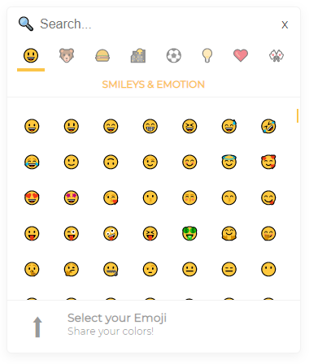

# Reaction.js

> If you're looking for a React Emoji Selector, there's [Emoji Mart](https://github.com/missive/emoji-mart)
> that provides a well documented and
> maintained Slack-like Emoji selector implementing most of the Selector features
> planned here.

**Reaction.js aims to provide developpers with a complete package to easily add emojies and reactions to their applications.**

Users love to react to everything, but  often, the added value of those features is fairly small. Therefore, more often than not, they're delayed or ignored. We aim to change that by providing customizable, lightweight components to easily implement all sorts of reactions to React applications.

Here what's planned so far:

- An Emoji Selector;
- A Reaction Indicator/Selector;
- Emoji Suggestions.

## Getting Started

1. Run `git clone https://github.com/Dahmer-Open/Reaction.js.git`;
2. Install dependencies, in the root directory, run `npm i`;
3. Start the project `npm start`.

## Roadmap

The roadmap below details a bunch of feature that will be implemented in Reaction.
I will continue developing it in my spare time, but if we reach the given star milestones, I'll implement them right away as I consider that there's enough interest in the project for it to move forward.

| Done  |Stars ⭐| Feature                                     |
|--------|--------|---------------------------------------------|
| [   ]  | 5      | Reaction tags                               |
| [   ]  | 5      | BONUS ~ Package and Publish to NPM          |
| [   ]  | 10     | Improve Selector positionning               |
| [   ]  | 15     | Emoji Suggestions                           |
| [   ]  | 15     | BONUS ~ Setup demo website                  |
| [   ]  | 30     | Search optimizations                        |
| [   ]  | 30     | BONUS ~ Tests (CI)                          |
| [   ]  | 35     | Skin Tone Selection                         |
| [   ]  | 40     | Add Recently Used Emojies (History)         |
| [   ]  | 45     | Selector Scroll Through Categories          |
| [   ]  | 55     | Value Overrides (Text, labels, etc.)        |
| [   ]  | 80     | Theming                                     |
| [   ]  | 80     | BONUS ~ Optimizations                       |
| [   ]  | 105    | Different OS Emojies (Apple, Android, etc.) |
| [   ]  | 150    | Custom Emoji sets                           |

Feel free to create a discussion issue if you would like me to reconsider task priorization.

## Contribution

I have no contribution guidelines/systems yet, if you would like to contribute, again, feel free to create a discussion issue and I'll set a few things up so we can work together :)